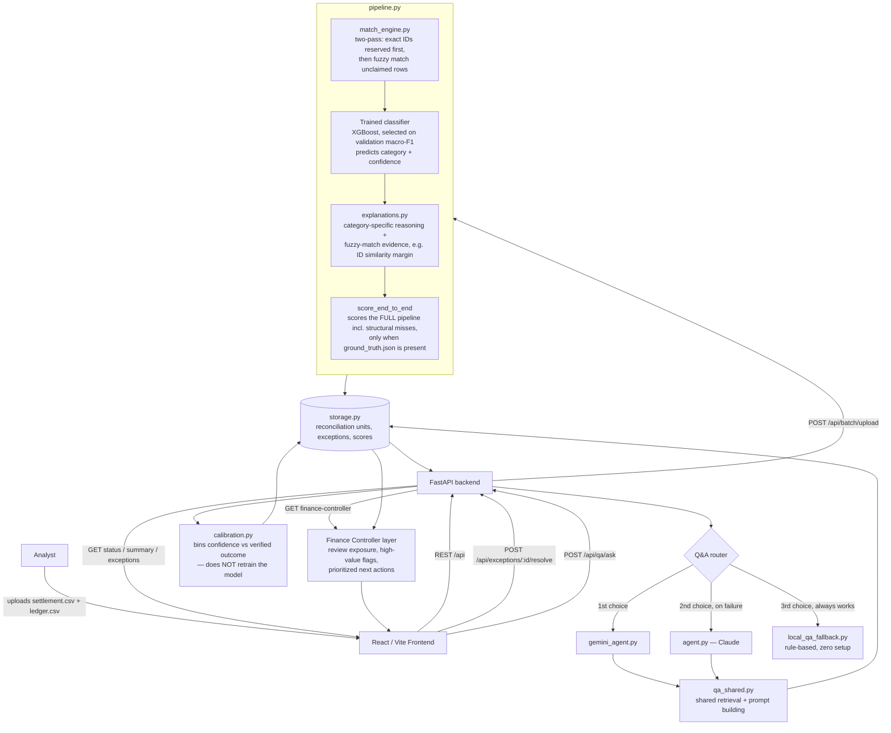

# Verity — Architecture

Razorpay AI Buildathon 2026 — Track 04: AI Finance Controller

## System diagram

## Data flow, in order

1. **Upload.** Analyst uploads a settlement export and internal ledger (optionally `ground_truth.json`, used for demo/holdout batches only — a real production upload has no ground truth, and the pipeline correctly omits the end-to-end score rather than fabricating one).
2. **Matching — now two true passes.** All exact order-ID matches are reserved first; fuzzy matching then runs only against unclaimed ledger rows. This fixed a real bug: previously a fuzzy match could consume a ledger row before its exact counterpart was even processed.
3. **Reconciliation units, not raw rows.** Duplicate settlement rows sharing a `payment_id` are collapsed into one reconciliation unit before scoring, so duplicates can't silently inflate the denominator or the exception count.
4. **Classification, with richer fuzzy evidence.** The classifier now also sees best-ID-similarity, runner-up similarity, the margin between them, and a low-margin flag — so a close call between two candidates is explicit input, not hidden inside a single similarity score.
5. **Explanation.** `explanations.py` gives category-specific reasoning, and distinguishes "IDs differ, here's the closest candidate" from "IDs match exactly, but the amounts make this pairing suspicious" — these used to be conflated under one generic ID_AMBIGUOUS explanation.
6. **Three separate, honestly-labeled metrics** (this replaced a single blended score):
   - **Auto-reconciliation rate** — the share of reconciliation units resolved with zero human input.
   - **End-to-end precision/recall/F1** — the whole pipeline scored against ground truth, including cases the matcher never even found a candidate pair for (previously invisible to the score).
   - **Candidate-pair F1** — classifier-only accuracy on pairs it did find, kept as a separate diagnostic rather than presented as the system's overall accuracy.
   - Deterministic findings (`MISSING_IN_LEDGER`, `MISSING_IN_SETTLEMENT`) carry `confidence_score = null` and are labeled as rule-based checks, not dressed up as 100%-confidence ML output.
7. **Storage.** Every batch's matches, exceptions, and all three scores land in `storage.py`.
8. **Finance Controller layer** (`GET /api/batch/{batch_id}/finance-controller`) turns stored results into what a controller actually needs: review exposure in ₹, the highest-risk category by finance-ops priority, exceptions crossing a ₹10,000 threshold, and a ranked action list. It reads from stored output only — it does not touch matching, the model, or the evaluation metrics.
9. **Human correction → confidence calibration, not retraining.** When an analyst confirms or rejects an exception, that correction is grouped into a confidence bin. A bin only starts counting toward "auto-resolution coverage" once it has enough verified corrections behind it. This is a deliberate, permanent design choice, not a placeholder for online learning — the model itself is not retrained by this loop.
10. **Ask Verity.** A question is routed through a three-tier fallback — Gemini first, Claude on failure, then a local rule-based responder that always works even with zero API keys configured — all three sharing the same retrieval logic in `qa_shared.py`.

## Design decisions

- **Why report three metrics instead of one?** A single blended number let a classifier-only score stand in for whole-system accuracy, which overstates what the system actually caught (it hides cases the matcher never found a candidate for at all). Splitting auto-reconciliation rate, end-to-end score, and candidate-pair score makes each claim checkable against a specific, named thing.
- **Why binned calibration instead of retraining online?** With real corrections this imbalanced (a large majority "flag was correct," a small minority false alarms), online retraining on small, skewed batches risks the model drifting on noise rather than genuine signal. Binned confidence tracking is more robust to small sample counts, is fully auditable (you can see exactly which bin has how much evidence), and never silently changes model behavior between demos — a deliberate trust trade-off, not a missing feature.
- **Why two-pass matching?** So a lower-confidence fuzzy match can never "steal" a ledger row from the exact match that should have claimed it — order matters, and getting it wrong silently corrupts downstream classification.
- **Why does the Finance Controller layer sit on top of storage rather than inside the pipeline?** So it can never influence matching or model output — it's a read-only reporting layer, keeping "what happened" (pipeline) cleanly separate from "what should a human do about it" (Finance Controller).
- **Why three Q&A tiers?** So the demo (and any real deployment) always works even with no API keys configured — Gemini and Claude add quality, the local fallback guarantees availability.

## Stack

- **Frontend:** React + Vite, wired to `/api`
- **Backend:** FastAPI
- **Model:** XGBoost, selected over Logistic Regression on held-out validation macro F1 (a validation-set hyperparameter sweep confirmed the existing configuration as best, so it was kept rather than swapped for one that only looked better on one batch)
- **Matching engine:** custom two-pass exact + fuzzy matcher (`match_engine.py`)
- **Finance Controller:** read-only reporting layer over stored reconciliation output
- **Q&A:** Gemini → Claude → local rule-based fallback, sharing one retrieval layer
- **Data:** synthetic, schema-aligned to Razorpay's real Settlement Recon API fields (see `RAZORPAY_SCHEMA_NOTES.md`)
